# Gridfinity Organizer

A self-hosted web app for cataloguing the contents of your [Gridfinity](https://gridfinity.xyz/) bins. Organise your workshop as **cabinets → drawers → grid positions**, give every bin a printed QR code, and find anything in seconds — from a laptop or right at the bench on your phone.

> Built around a small Postgres + Node.js stack. No build pipeline, no framework, no account system. Spin it up with one `docker compose` command and start tagging bins.

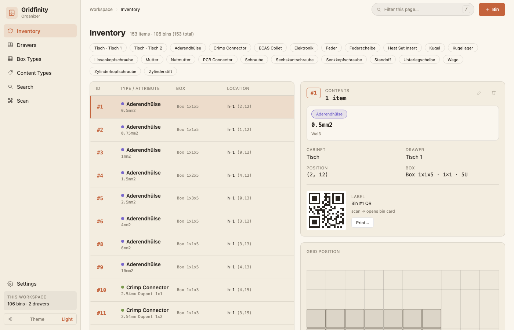

---

## Highlights

- 📦 **Inventory split view** — one row per item, with a detail card showing every item in the selected container, plus a live grid-position mini-map that highlights exactly where the selected bin sits in its drawer.
- 🧩 **Multi-item divided bins** — a 2-compartment box holds two distinct items, a 4-comp box holds four, and so on. Undivided boxes are capped at one.
- 🗄️ **Visual drawers** — each cabinet shows mini-maps of its drawers with bins drawn in their actual positions.
- 📐 **Box-type gallery** — vector previews of every Gridfinity footprint you have, divided bins included.
- 🏷️ **Editable content tags** — rename "Bolt" → "Bolts" and every item that uses it updates instantly.
- 🎨 **Multi-color taxonomy** — each tag picks one of four palette colors so the drawer map turns into a glanceable heat-map.
- 🔎 **Live quick-filter** — the topbar search box filters whatever list is on screen as you type (no navigation, no page reload); a dedicated **Search** page is still there for a full cross-field search.
- 📷 **In-app QR scanner** — open the **Scan** tab on your phone, point at a sticker, jump straight to the bin.
- 📱 **Scan a QR → mobile detail page** — print the code, stick it on the bin, the public detail page lists everything inside.
- ⚙️ **Settings panel** — a proper Settings window (gear icon) with Appearance (theme), Menu Items (show/hide/reorder the sidebar), and a Database section covering backups and export/import. See [Settings](#settings) below.
- 🌓 **Light & dark themes** — clay-and-paper or VS Code-style. Respects `prefers-color-scheme`, and switchable from Settings → Appearance.
- 📲 **Mobile layout** — narrow viewports get a bottom nav, a full-width filter bar, edge-to-edge cards, and tapping an inventory row splits the table open in place instead of hiding detail off-screen. Desktop is untouched.
- 💾 **Built-in backups** — automatic `pg_dump` on every restart and on a schedule (interval editable live from Settings, no restart needed), with a one-shot restore flag, plus one-click manual backups, SQL/CSV export, and a non-destructive CSV import.

---

## Quick start

You need **Docker** and **docker-compose** (v2). Nothing else.

```bash
git clone https://github.com/YOUR-FORK/gridfinity-organizer.git
cd gridfinity-organizer
docker compose up -d
```

Open **<http://localhost:3333>** and you're in. The first launch seeds the database with 4 example drawers, 9 common Gridfinity box types, and an 11-tag content-type catalog so the UI has something to draw.

> 💡 **Want to use it from your phone too?** Open the app from your computer's LAN IP (e.g. `http://192.168.1.50:3333`) the very first time. QR codes encode whatever origin you visit the app from, so a code generated while you were on `localhost` won't be reachable from another device.

To stop the stack: `docker compose down`. To wipe everything (including data): `docker compose down -v`.

---

## Configuration

All settings live in [`docker-compose.yml`](docker-compose.yml). The defaults work out of the box; tweak the env vars on the `backend` service to taste.

### Database

| Variable | Default | What it does |
|---|---|---|
| `DB_HOST` | `postgres` | Hostname of the Postgres service |
| `DB_PORT` | `5432` | Postgres port |
| `DB_NAME` | `gridfinity` | Database name |
| `DB_USER` | `gridfinity` | Database role |
| `DB_PASSWORD` | `gridfinity_pw` | **Change this** if you expose the app outside your LAN |
| `PORT` | `3333` | HTTP port the backend listens on |

### Backups

The backend ships with a small backup module that runs `pg_dump` on every startup and on a recurring interval. Dumps land in a host directory you can browse and copy off-box. The interval, manual backups, and export/import are also reachable live from **Settings → Database** in the UI — see [Settings](#settings).

| Variable | Default | What it does |
|---|---|---|
| `BACKUP_DIR` | `/backups` | Where dumps live inside the container (bind-mounted from `./backups` on the host) |
| `BACKUP_INTERVAL_DAYS` | `7` | Schedule cadence in days — **seeds the initial value only** (same pattern as `QR_PAYLOAD_MODE` below). After first boot, Settings → Database → Backup is the source of truth; changing it there reschedules the running backend immediately, no restart needed |
| `BACKUP_RETAIN` | `14` (`5` in the shipped compose file) | How many of the newest dumps to keep. Older ones are pruned after each new backup |
| `RESTORE_FROM` | _(unset)_ | If set to a filename in `BACKUP_DIR`, the backend restores from it on boot **before** running migrations |

### Changing the port

Edit the `ports:` line in `docker-compose.yml`:

```yaml
backend:
  ports:
    - "8080:3333"   # host:container — visit http://localhost:8080
```

---

## Using the app

### Adding your first bin

1. Click **+ Drawer** (top-right of the **Drawers** tab) and describe a real drawer — its cabinet, name, grid dimensions, and how tall stacks can go.

   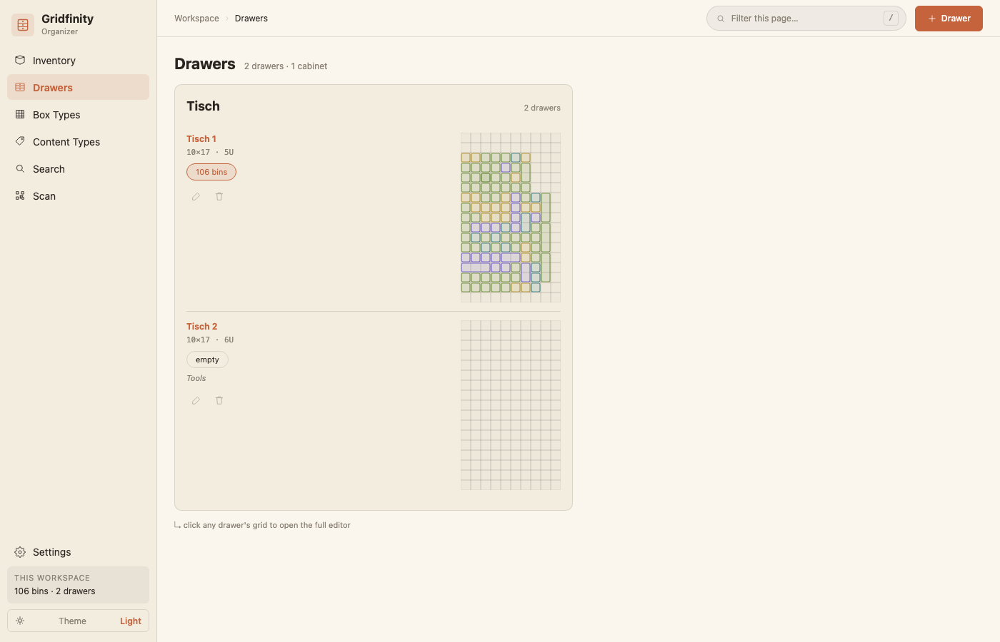

2. Switch to **Box Types** and either pick one of the seeded shapes or add your own (e.g. `1×2×3`, `1×4 Div×3`).

   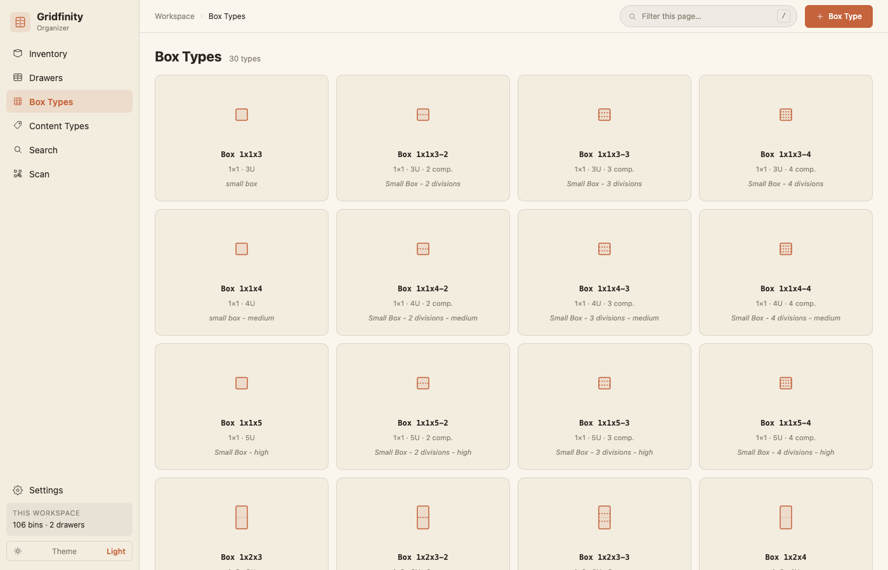
3. Back on **Inventory**, click **+ Bin**:
   - Pick a **box type**. Undivided types lock the form to one item; divided types unlock an `Items (N/cap)` editor where you can hit *Add item* up to `cap` times — one row per compartment.
   - For each item, pick a *content type* (or type a new one — the catalog will pick it up) and write the *attribute* — the specific thing inside: `M5×30`, `JST 2.54 mm`, etc. Notes are optional.
   - Choose the drawer.
   - In the grid picker, click the top-left corner where the bin sits. The footprint highlights green.
   - **↻ Rotate** swaps width and length for non-square bins.
4. Save. The bin gets a numeric ID (`#1`, `#2`, …) and shows up in the list. A divided bin's items appear as separate rows tagged `#1·A`, `#1·B`, … so you can tell which compartment holds what.

> ✋ **Capacity is enforced server-side.** Trying to save more items than a box type's `compartments` value returns an error — switch to a divided box type with the right compartment count first.

### Printing the QR

Open the bin in the inventory list. The detail pane on the right shows a small QR. Click **Print…** for a paper-friendly version, then stick it on the bin. Scanning the printed code on any phone opens a public page with the bin's contents, location, and another QR.

### Renaming tags safely

The **Content Types** tab is the source of truth for tag names. Renaming a tag is one SQL `UPDATE` — every item that referenced it picks up the new name through the foreign key. Deleting a tag clears that field on referencing items (`ON DELETE SET NULL`), so the items survive but lose their type label.

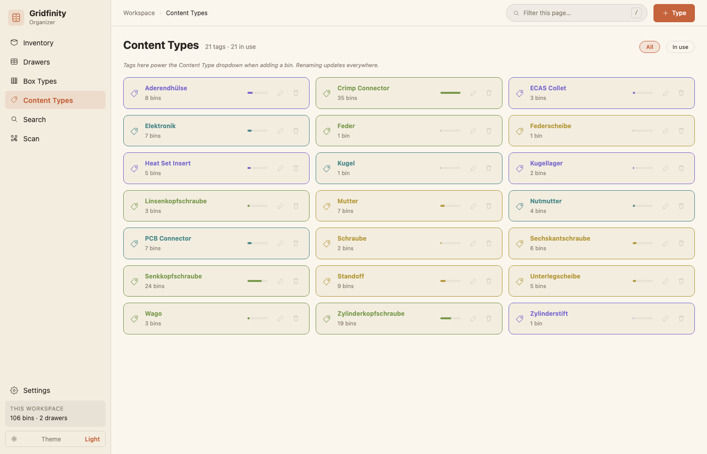

### Switching themes

Use the **☀️/🌙** toggle in the sidebar (or its mobile counterpart), or set it from **Settings → Appearance**. The choice is saved to `localStorage`; first visits pick up your OS-level dark mode preference automatically.

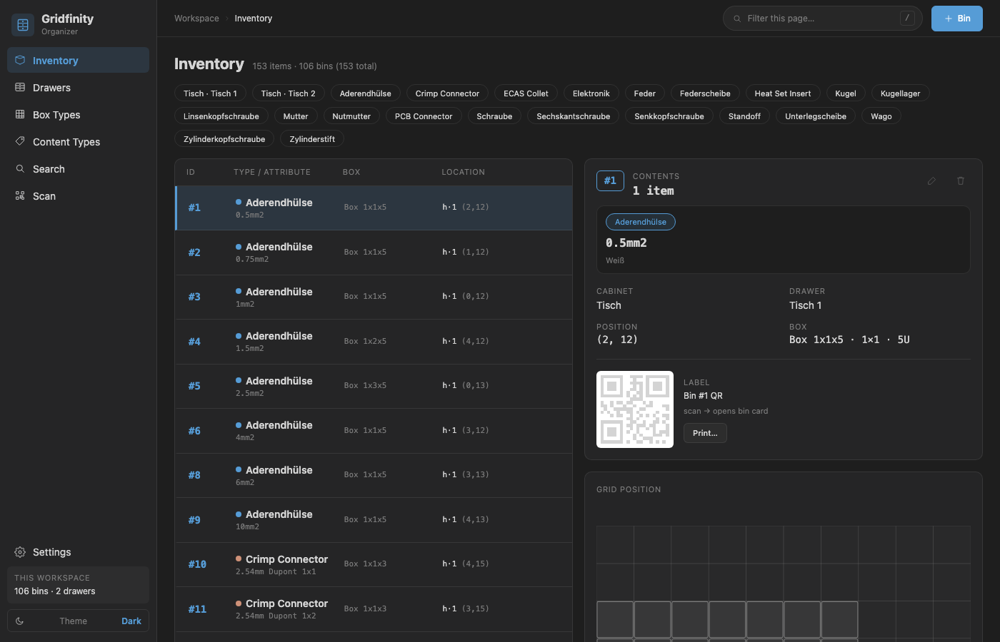

### Filtering the current page

The topbar search box doesn't navigate anywhere — it filters whatever's on screen as you type. Typing `M6` on the **Inventory** tab narrows the table to items whose content type, attribute, or notes contain "M6"; the same box narrows drawers, box types, and content tags on their respective pages. The **Search** page (sidebar) is unaffected and still does its own cross-field lookup.

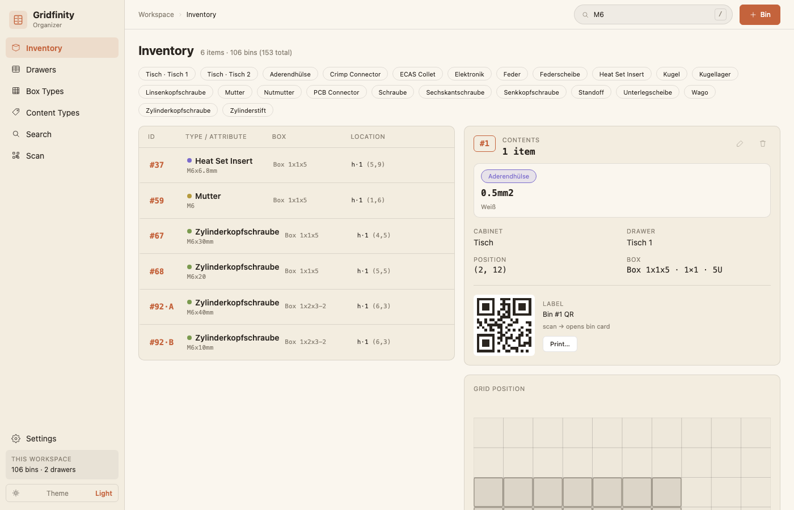

### On mobile

Narrow viewports swap the sidebar for a bottom nav and the detail/grid-position panel moves inline: tapping a row in the **Inventory** table splits the table open right there instead of hiding the detail off-screen, and the view stays anchored on the row you tapped.

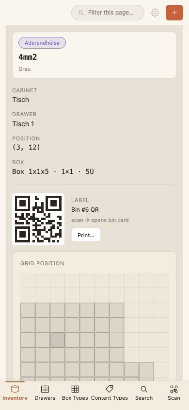

---

## Settings

Click the gear icon (sidebar on desktop, topbar on mobile) to open **Settings** — a small modal split into a page list on the left and content on the right.

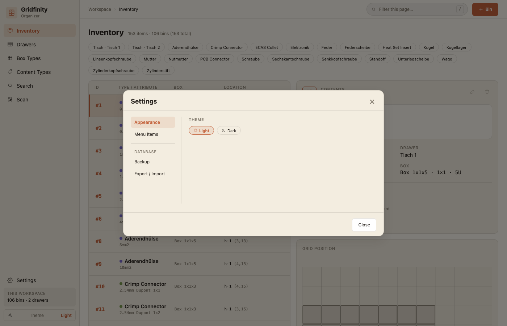

### Appearance

Just the light/dark theme selector, mirroring the sidebar toggle.

### Menu Items

Every sidebar / bottom-nav entry, with a checkbox to show or hide it and up/down arrows to reorder it. Changes apply immediately and are remembered per-browser (`localStorage`) — they don't touch the server, so each device/browser can have its own layout.

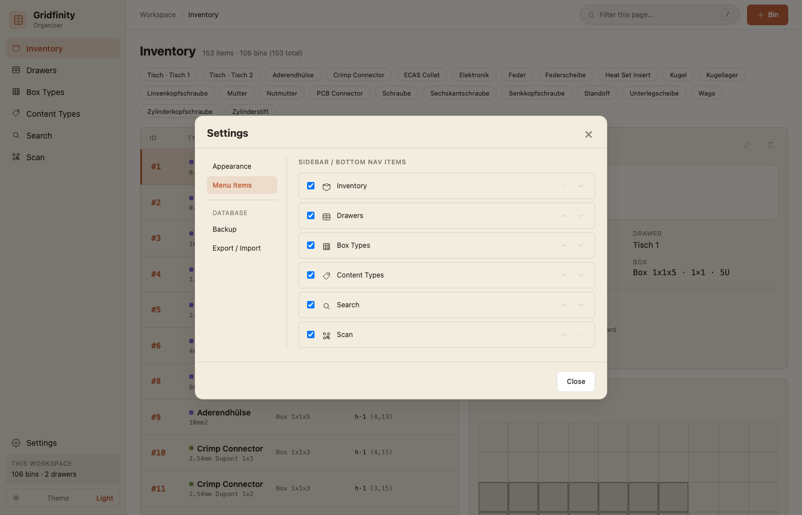

### Database

Two pages, separated from the rest of the list by a divider:

**Backup**

- **Backup interval (days)** — live-editable version of `BACKUP_INTERVAL_DAYS` (see [Backups](#backups) below). Saves to the database and reschedules the running backend immediately.
- **Create Backup** — triggers an on-demand `pg_dump` right away, on top of the startup/scheduled ones.

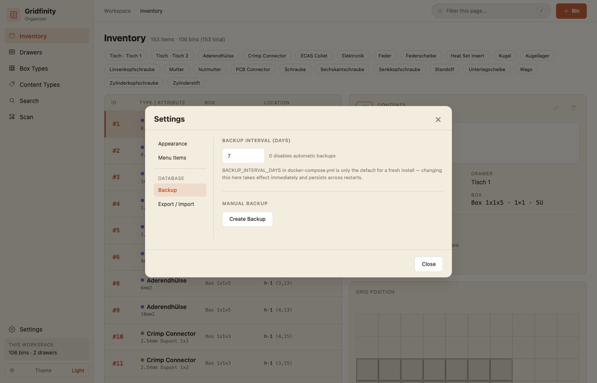

**Export / Import**

- **Export** — pick **SQL** (a full `pg_dump`, identical in shape to the automatic backups — the right choice for moving to a new host or a true restore) or **CSV** (one row per item, with its box type, drawer, position, tag, attribute, and notes — a spreadsheet-friendly sheet, not a full schema dump). Either downloads straight from the browser.
- **Import** — accepts a CSV in the export's own shape and is **strictly additive**: it only inserts new bins/items, never updates or deletes anything. A row is skipped (and reported) if its box type or drawer doesn't already exist; if its recorded grid position is already occupied, the bin is imported unplaced rather than overlapping something. There's no SQL import — applying a full dump non-destructively isn't something that can be done safely, so full-fidelity transfer goes through [`RESTORE_FROM`](#restoring-a-previous-dump) instead, which is deliberately a full overwrite.

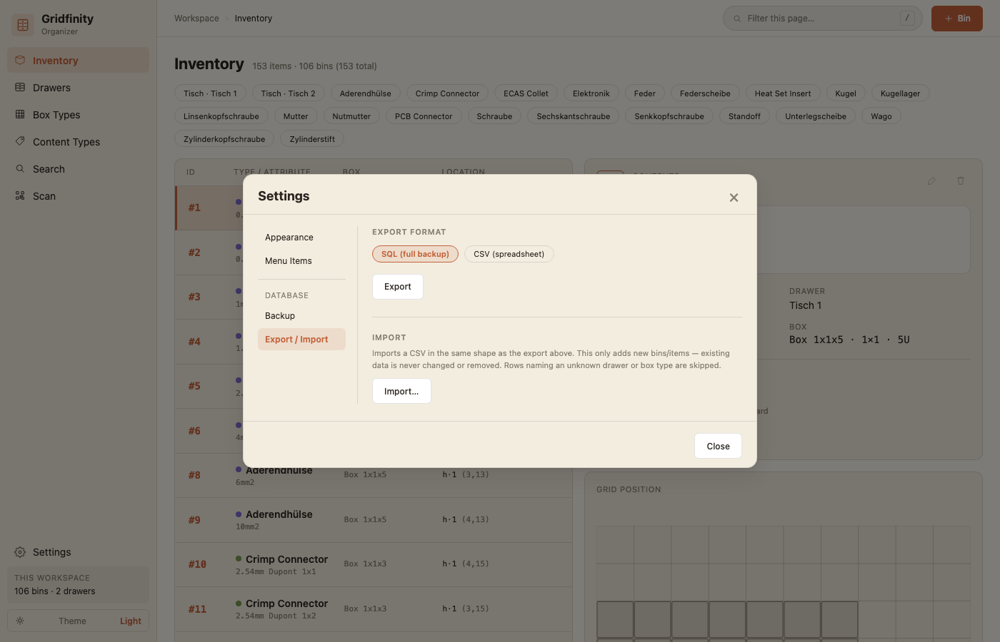

---

## Host-portable QR codes

Printed stickers can outlive your host setup. The backend supports two QR payload formats; the in-app scanner reads either.

| `QR_PAYLOAD_MODE` | Payload encoded | Native iOS Camera app | Scanner-only |
|---|---|---|---|
| `url` *(default)* | `https://host/bin/42` | ✅ | — |
| `id` | `gfbin:42` | ❌ | ✅ |

If you're going to print stickers once and never reprint, switch to `id` mode. The codes won't know your host name and stay valid through every server move.

**Flip it from the UI** (recommended): open the **Scan** tab and toggle between `URL` and `gfbin:N` in the page header. The choice is persisted in Postgres (table `app_settings`) and takes effect on the next QR you render — no restart.

The `QR_PAYLOAD_MODE` env var only **seeds the initial value** on a fresh database. After that the UI toggle wins; changing the env var doesn't override what's in the DB. For unattended provisioning you can pre-seed the value:

```yaml
# docker-compose.yml — only used on a fresh DB
backend:
  environment:
    QR_PAYLOAD_MODE: id
```

Scan codes from any mode with the **Scan** tab in the sidebar. The scanner accepts both `gfbin:N` and full `…/bin/N` URLs, so old stickers keep working when you switch.

---

## Camera & HTTPS

The in-app scanner uses the browser's `getUserMedia` API. **Modern browsers — iOS Safari especially — only allow camera access on a secure origin (HTTPS, or `localhost`).** Plain HTTP on a LAN IP will never trigger the camera prompt. This is a security boundary, not a misconfiguration you can flag-away.

Two pragmatic paths to add HTTPS:

### A. Caddy reverse proxy on the LAN (recommended)

A small `caddy` service block is included in `docker-compose.yml` — commented out by default. To enable:

1. Uncomment the `caddy:` service and the two `caddy_*` lines in the `volumes:` section.
2. `docker compose up -d`. Caddy starts on `:443` using its built-in CA (`tls internal`).
3. Visit `https://<host-ip>/` on your phone and accept the cert warning **once**. The scanner now works.

Want no warnings? Either:

- **mkcert** (LAN-trusted certs):
  ```bash
  brew install mkcert nss              # macOS — Linux is `apt`/`dnf`
  mkcert -install                      # adds the mkcert root CA to your trust store
  cd caddy
  mkcert -cert-file certs/cert.pem -key-file certs/key.pem \
         gridfinity.local 192.168.1.50  # adjust to your host's name/IP
  # Edit caddy/Caddyfile: replace `tls internal` with
  #   tls /certs/cert.pem /certs/key.pem
  docker compose restart caddy
  ```
  Install the mkcert root CA on every phone you scan from (one-time; instructions in the [mkcert README](https://github.com/FiloSottile/mkcert#installation)).

- **Caddy's root CA** (no extra tooling):
  ```bash
  docker compose exec caddy caddy trust-pem
  # → prints PEM. Save as `caddy-root.crt`, email it to yourself,
  #   open on iPhone, Settings → General → Profile → install.
  ```

### B. Tailscale Magic DNS + HTTPS (cleanest if you already use Tailscale)

Tailscale gives every machine on your tailnet a real Let's Encrypt cert:

1. Install Tailscale on the Docker host, enable HTTPS in the admin console.
2. Run `tailscale cert <hostname>.<tailnet>.ts.net` on the host — drops `cert.pem` + `key.pem` in the working directory.
3. Copy them into `./caddy/certs/`, edit the Caddyfile to use them (as in mkcert step), restart Caddy.
4. Scan QRs from any phone on your tailnet via the `https://hostname.tailnet.ts.net` URL — no cert warnings, no root CA install.

### Trade-offs at a glance

| Approach | Setup time | Cert warnings | Where it works |
|---|---|---|---|
| Plain HTTP | 0 min | — | Anywhere, but **no scanner** |
| Caddy + `tls internal` | 2 min | First-visit warning per device | Anywhere on the LAN |
| Caddy + mkcert | 10 min | None (after root install) | Anywhere on the LAN |
| Caddy + Tailscale cert | 15 min | None | Anywhere on the tailnet |

---

## Backup & restore

Backups are **already running** the moment you start the stack — no configuration needed. You'll see them appear in `./backups/`:

```bash
$ ls ./backups
gridfinity-2026-05-15T18-00-57Z.sql
gridfinity-2026-05-22T18-00-57Z.sql
```

### Manual backups

The easiest way is **Settings → Database → Backup → Create Backup** in the UI — one click, no restart. Without the UI, the startup backup gives you a fresh dump on every restart, so the CLI equivalent is:

```bash
docker compose restart backend
```

### Restoring a previous dump

Pick a file from `./backups` and pass its name through the `RESTORE_FROM` env var:

```bash
RESTORE_FROM=gridfinity-2026-05-15T18-00-57Z.sql docker compose up -d backend
```

What happens on boot:

1. The dump is applied with `psql -v ON_ERROR_STOP=1`. The dump uses `--clean --if-exists`, so it **wipes existing objects** and recreates them from the snapshot.
2. The schema upgrade (`ensureSchema()`) runs so any newer migrations apply on top.
3. A new startup backup is taken — so the pre-restore state is also captured.
4. A `.last-restore` marker is written so subsequent restarts with the same `RESTORE_FROM` value are no-ops. To re-apply the same file, delete `./backups/.last-restore`.

> ⚠️ Restore is a **full overwrite**, not a merge. If you only want to inspect a backup, copy the SQL file out and apply it to a separate database.

### Disabling the schedule

Set the interval to `0` in **Settings → Database → Backup** (takes effect immediately), or set `BACKUP_INTERVAL_DAYS: 0` in `docker-compose.yml` before the first boot if you only want the startup dump from day one.

---

## Architecture

The whole app is two services:

```
┌──────────────────────────────┐
│   backend (Node.js 20)       │
│   ├── Express REST API       │
│   ├── pg_dump / psql tools   │
│   └── express.static SPA     │
└────────────┬─────────────────┘
             │ pg pool
             ▼
┌──────────────────────────────┐
│   postgres (PostgreSQL 16)   │
│   volume: postgres_data      │
└──────────────────────────────┘
```

- **PostgreSQL 16** in a named volume — survives container restarts.
- **Node.js 20 + Express 4 + `pg`** — no ORM, parameterised SQL everywhere.
- **Vanilla JS SPA** under `backend/public/` — no bundler, no framework, no build step. The frontend is plain `<script>` files served by `express.static`. Theming is done with CSS custom properties; the only dependency loaded over the wire is `qrcodejs` from a CDN.
- **No login.** This is a homelab tool — put it behind your reverse proxy / VPN if you expose it.

### Project layout

```
gridfinity-organizer/
├── docker-compose.yml              # postgres + backend services
├── init.sql                        # schema DDL + seed (runs only on a fresh DB volume)
├── backups/                        # SQL dumps land here (bind-mounted)
├── Documentation/
│   ├── images/                     # screenshots embedded in this README
│   └── Scripts/                    # capture-screenshots.js — renders the images above
└── backend/
    ├── Dockerfile                  # node:20-alpine + postgresql16-client
    ├── package.json                # deps: express, pg, cors
    ├── server.js                   # REST routes + ensureSchema() migration
    ├── backup.js                   # pg_dump / psql + retention + RESTORE_FROM + live rescheduling
    └── public/
        ├── index.html              # thin shell — modals, root div, script tags
        ├── icons/                  # SVG sprite (22 icons)
        ├── styles/
        │   ├── tokens.css          # design tokens — colors, type, spacing, motion
        │   └── main.css            # component styles + mobile media block
        └── js/
            ├── core.js             # state, api helper, esc, contentHue, icon helper, isMobile
            ├── theme.js            # light/dark toggle + persistence
            ├── app.js              # App namespace, shell render, Settings modal, MenuItems
            └── views/              # one file per screen
                ├── inventory.js
                ├── locations.js
                ├── box-types.js
                ├── content-types.js
                ├── search.js
                ├── scanner.js
                ├── bin-form.js
                ├── bin-scan.js
                ├── drawer-map.js
                └── qr.js
```

### Data model

```
locations ──┐
            │ 1
            ▼ *
            bins ────┬──→ box_types
                     │
                     │ 1
                     ▼ 1..N
                  bin_items ──→ content_types
```

- `locations` — one row per drawer; tracks cabinet name, drawer name, grid dimensions, and max stack height.
- `box_types` — catalog of Gridfinity footprints (size, height, `is_divided`, `compartments`).
- `bins` — physical containers. Store their own `grid_width`/`grid_length` (denormalised from `box_types`) so the placement grid never needs a join, and so the rotate button has somewhere to put the swapped dimensions. **No content fields** — those live in `bin_items`.
- `bin_items` — what's inside a bin. Each row holds one item: `bin_id`, `slot` (0-indexed compartment), `content_type_id`, `attribute`, `notes`. A `UNIQUE(bin_id, slot)` constraint prevents two items in the same compartment; `ON DELETE CASCADE` from `bins` cleans up when a container is removed. The server caps row count at `box_types.compartments` for divided bins, `1` for undivided.
- `content_types` — user-editable tag catalog. `bin_items` reference by id, so renames are a single SQL `UPDATE`.

Schema migrations are additive and idempotent — they live in [`ensureSchema()`](backend/server.js) and run on every boot. The initial DDL in [`init.sql`](init.sql) only fires on a fresh Postgres volume. The legacy single-content schema is upgraded automatically: the first time a server boots after the multi-item refactor, each existing `bin` becomes a single-slot `bin_item` and the legacy columns are dropped in one transaction.

### REST API

All routes are JSON. Parameterised queries via `pg`.

| Method | Path | Notes |
|---|---|---|
| `GET` / `POST` | `/api/locations` | List or create drawers |
| `GET` / `PUT` / `DELETE` | `/api/locations/:id` | Single drawer |
| `GET` | `/api/locations/:id/bins` | Bins inside a drawer (drives the visual map) |
| `GET` / `POST` | `/api/box-types` | List or create box types |
| `GET` / `PUT` / `DELETE` | `/api/box-types/:id` | Single box type |
| `GET` / `POST` | `/api/content-types` | List or create tags |
| `GET` / `PUT` / `DELETE` | `/api/content-types/:id` | Single tag — rename cascades through the FK |
| `GET` | `/api/bins/search?q=` | Returns **one row per matching `bin_item`** with its parent bin's context |
| `GET` / `POST` | `/api/bins` | List or create containers. `POST` accepts an optional `items: [{ content_type, attribute, notes }]` array, capped at the box type's `compartments` |
| `GET` / `PUT` / `DELETE` | `/api/bins/:id` | Single container. `PUT` replaces the items array transactionally when one is supplied; omit it to update bin metadata only |
| `GET` / `PUT` | `/api/config` | Runtime settings (currently just `qrPayloadMode`) |
| `GET` / `PUT` | `/api/backup/settings` | Backup interval in days — `PUT` reschedules the running backend immediately |
| `POST` | `/api/backup/create` | Triggers an on-demand `pg_dump` |
| `GET` | `/api/export?format=sql\|csv` | Streams a full SQL dump or a flattened one-row-per-item CSV as a download |
| `POST` | `/api/import` | Body is a raw CSV (matching the export shape) as text — additive only, see [Settings → Database](#database-1) |
| `GET` | `/bin/:id` | Public scan page (serves the SPA, which renders the detail with every item) |

#### Bin shape

A bin returned by `GET /api/bins` looks like this:

```jsonc
{
  "id": 6,
  "location_id": 1,
  "grid_x": 0, "grid_y": 0,
  "grid_width": 1, "grid_length": 2,
  "height_u": 3,
  "box_type_id": 10,
  "box_type_name": "1×2 Div×3",
  "is_divided": true, "compartments": 2,
  "items": [
    { "id": 1, "slot": 0, "content_type_id": 16, "content_type": "Bolt", "attribute": "M5×10", "notes": null },
    { "id": 2, "slot": 1, "content_type_id": 17, "content_type": "Nut",  "attribute": "M5",    "notes": null }
  ]
}
```

---

## Development

Everything is in `backend/`. There's no separate frontend build — edits to the static assets show up on the next browser refresh **after** a container rebuild.

### Live-edit loop

The Dockerfile bakes `backend/public/` into the image, so editing files on the host doesn't auto-reflect. Two options:

**Option A — rebuild on each change** (simple, what the default compose does):

```bash
docker compose build backend && docker compose up -d backend
```

**Option B — bind-mount the public directory** (true live-edit; refresh the browser):

```yaml
# docker-compose.yml — add under the backend service
backend:
  volumes:
    - ./backups:/backups
    - ./backend/public:/app/public:ro   # add this line
```

### Running the backend on the host (no Docker)

You still need a Postgres reachable somewhere:

```bash
cd backend
npm install
DB_HOST=localhost \
DB_USER=gridfinity \
DB_PASSWORD=gridfinity_pw \
DB_NAME=gridfinity \
node server.js
```

### Talking to Postgres directly

```bash
docker compose exec postgres psql -U gridfinity -d gridfinity
```

### No tests, no linter

This is a hobby project — there's no test suite or eslint config to run. Verify changes by exercising the UI in a browser; the golden paths are: add an undivided bin with one item → save; add a divided 2-comp bin with two items → save → check the inventory shows two rows tagged `#N·A`/`#N·B`; place a bin on the grid → rotate → save; rename a tag and check existing items update; scan a printed QR.

### Regenerating the README screenshots

The images in this README are rendered from the actual running app (not mockups), via a small standalone Playwright script that lives outside `backend/` so it never touches the app's own dependencies:

```bash
cd Documentation/Scripts
npm install
docker compose up -d          # from the repo root, if it isn't already running
npm run capture                # writes PNGs into ../images
```

It only reads data through the UI — it never creates, edits, or deletes anything — so it's safe to re-run any time and it'll simply reflect whatever's currently in your database. Override the target with `APP_URL=http://host:port npm run capture` if you're not on the default `http://localhost:3333`.

---

## Customising the look

All visual decisions are in CSS variables defined in [`tokens.css`](backend/public/styles/tokens.css). Want a different accent? Override `--accent` for the relevant theme block:

```css
/* in a new <style> block, or appended to main.css */
[data-theme="light"] {
  --accent: #6f42c1;   /* purple instead of clay */
}
```

The four `--hue-1` … `--hue-4` tokens drive the multi-color taxonomy. Edit those and every content-tag pill picks up the new palette automatically.

---

## Roadmap

Things that would make sensible next features (none of these ship today):

- **Authentication** — currently the app is wide open. Behind a reverse proxy with basic auth or OIDC is the typical homelab pattern.
- **Image upload** — attach a photo to each bin. Needs an `image_url` column on `bins` plus a file-upload endpoint.
- **Bulk QR printing** — "print every QR in this drawer" as a single page.
- **Quantity & low-stock alerts** — `quantity` and `min_quantity` columns on `bins`, with a dashboard widget.
- **Drag-and-drop in the drawer map** — today you place via the modal grid picker; dragging tiles around in the cabinet view would be slicker.
- **⌘K command palette overlay** — there's a search *page* but no global overlay yet.

PRs welcome.

---

## License

MIT. Use it, fork it, sell consultancy around it — just don't blame me if you misplace a bolt.
